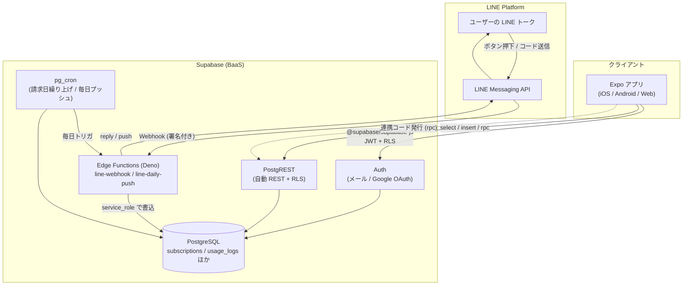
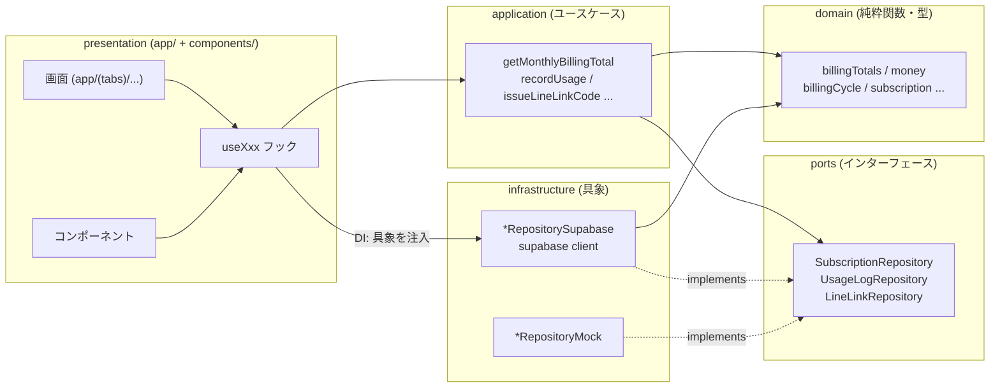
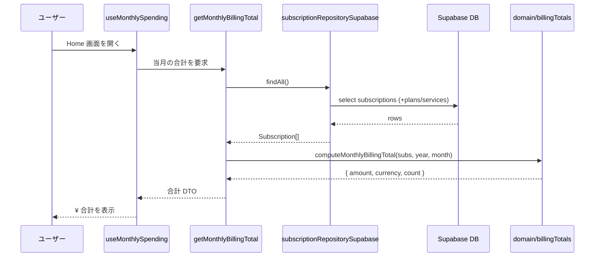
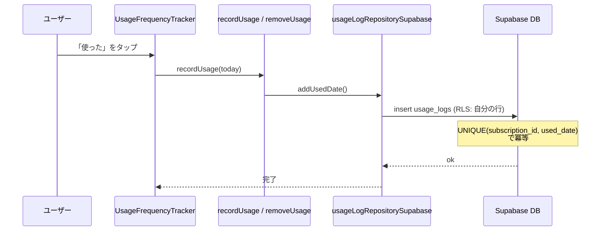
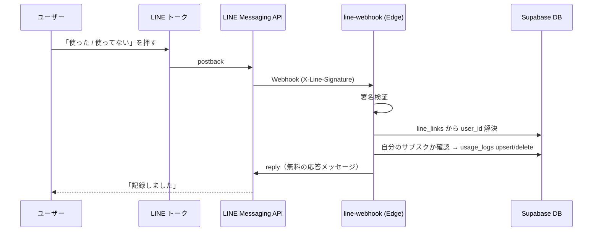
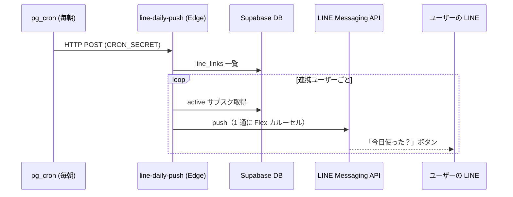
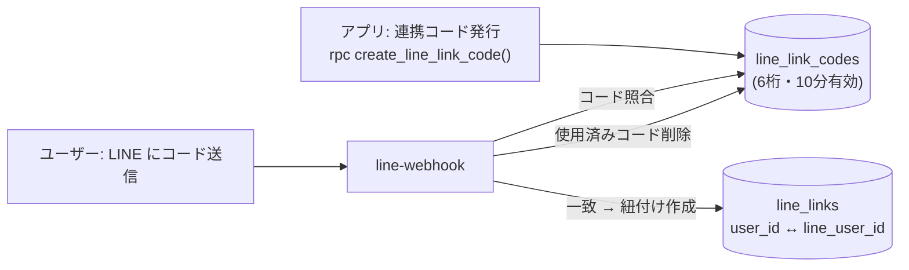
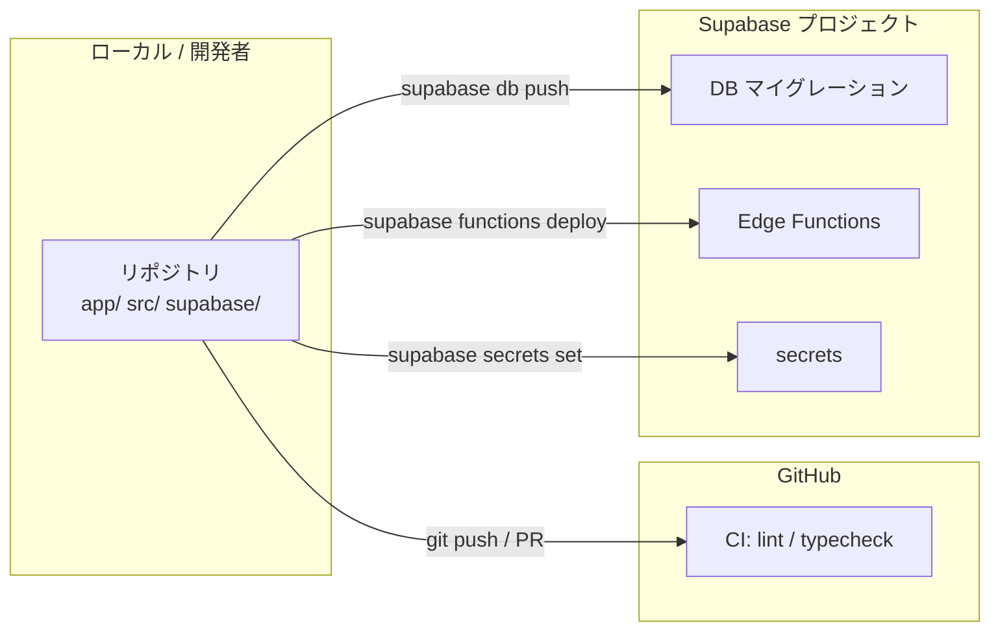

# アーキテクチャ全体図（Architecture Overview）

SubTrack の **システム全体構成**を Mermaid 図で俯瞰するためのドキュメント。
「どのフォルダに何を書くか」の実装ガイドは [`docs/ARCHITECTURE_GUIDE.md`](./ARCHITECTURE_GUIDE.md)、方針の正は [`docs/TRD.md`](./TRD.md) §1 を参照する。

## 関連ドキュメント

| 内容 | パス |
| --- | --- |
| ディレクトリ・層の実装ガイド | [`docs/ARCHITECTURE_GUIDE.md`](./ARCHITECTURE_GUIDE.md) |
| 技術方針（スタック・全体） | [`docs/TRD.md`](./TRD.md) |
| API 設計（PostgREST / Edge Functions） | [`docs/API_DESIGN.md`](./API_DESIGN.md) |
| DB 設計（ER・テーブル） | [`docs/DATABASE_DESIGN.md`](./DATABASE_DESIGN.md) |
| Edge Functions（LINE 連携） | [`supabase/functions/README.md`](../supabase/functions/README.md) |

---

## 1. システム全体構成

クライアント（Expo）、Supabase（BaaS）、外部サービス（LINE）の関係を示す。

ポイント:

- アプリは通常のデータ操作を **PostgREST + RLS** 経由で行う（`@supabase/supabase-js`）。
- LINE 連携の書き込みは **Edge Functions が service_role** で行い、署名検証で保護する。
- 定期処理（請求日の繰り上げ・毎日のプッシュ）は **pg_cron**。

---

## 2. フロントエンド（クリーンアーキテクチャ）

Expo アプリ内の依存方向。外側（UI）から内側（domain）へ依存し、**domain は React/Supabase に依存しない**。

詳細な配置例は [`docs/ARCHITECTURE_GUIDE.md`](./ARCHITECTURE_GUIDE.md)。

---

## 3. 主要データフロー

### 3-1. 今月の請求額表示（F-05）

集計ルール（active のみ・次回請求日が当月）は **domain に閉じている**ため、データソースや金額変動に依存しない。

### 3-2. 利用記録：アプリ経由（F-08）

### 3-3. 利用記録：LINE 経由（F-08 別チャネル）

### 3-4. 毎日のプッシュ（cron → LINE）

---

## 4. アカウント連携（LINE）

アプリでワンタイムコードを発行し、ユーザーが LINE に送ることで連携を確立する。

セキュリティ:

- `line_link_codes` は一般ユーザーから直接アクセス不可（RLS でポリシー無し）。発行は `SECURITY DEFINER` の RPC。
- 照合・連携確定・利用記録の書き込みは **Edge Functions の service_role** のみ。
- `service_role` キー・LINE トークンは **Edge の secrets** に保管し、クライアントへ出さない。

---

## 5. 環境・デプロイ

| 対象 | 反映コマンド | 補足 |
| --- | --- | --- |
| DB スキーマ | `supabase db push` | 変更は `supabase/migrations/` のみ（UI 直編集禁止） |
| Edge Functions | `supabase functions deploy <name>` | 何度でも上書き可。実行回数で課金（無料枠あり） |
| シークレット | `supabase secrets set` | 再デプロイで消えない |
| アプリ | Expo（EAS / ストア配布） | クラウド関数とは別系統 |

---

## 変更履歴

| 日付 | 内容 |
| ---- | ---- |
| 2026-06-06 | 初版（システム全体・クリーン層・主要フロー・LINE 連携・デプロイ） |
