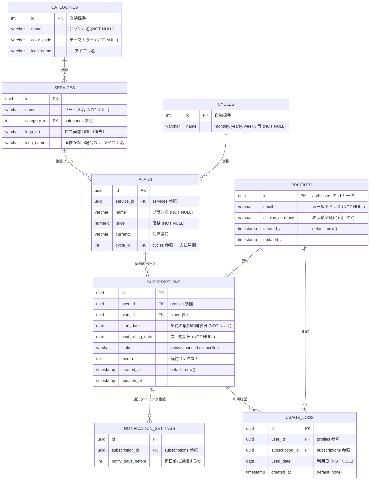

# データベース設計（Database Design）

本書をスキーマ仕様の**リポジトリ上の正**とする（実装は `supabase/migrations` 等と整合させる）。`docs/TRD.md` §4 から参照する。

**DBMS**: PostgreSQL（Supabase 内蔵）。物理名は **snake_case**・**複数形**を原則とする（下記 ER 図の大文字エンティティ名は概念的対応のみ）。

### スキーマ変更のルール

**Supabase ダッシュボード（Table Editor / SQL Editor 等）でのスキーマ変更は原則禁止。** テーブル・列・インデックス・RLS・ポリシーはすべて **`supabase/migrations/`** に SQL として追加し、PR でレビューする。例外・緊急時の扱いは [`docs/Rule.md`](./Rule.md)「データベーススキーマ（Supabase）」に従う。

---

## 関連

| 種別             | 参照                                                                                  |
| ---------------- | ------------------------------------------------------------------------------------- |
| 機能要件         | [`FEATURE_REQUIREMENTS.md`](./FEATURE_REQUIREMENTS.md)                                |
| 技術全体         | [`TRD.md`](./TRD.md)                                                                  |
| 外部メモ（任意） | [DB 設計（Notion）](https://www.notion.so/DB-34829a9d481180af930cff32915c3126?pvs=21) |

---

## ER 図

**補足**: 旧メモにあった `notify_timing` は **`notification_settings`** へ分離。ユーザー固有アイコンがマスタに要る場合は別途検討（現状は `services` の `logo_uri` / `icon_name` で表現）。

---

## 命名・共通ルール

| 項目     | 方針                                                                                        |
| -------- | ------------------------------------------------------------------------------------------- |
| 主キー   | `uuid`（`gen_random_uuid()` 等）または `int` + `GENERATED BY DEFAULT AS IDENTITY`（マスタ） |
| 日時     | `timestamptz`（`created_at` / `updated_at`）                                                |
| 金額     | `numeric`（通貨とセットで解釈）                                                             |
| 論理削除 | 現状なし（削除は物理削除 or アーカイブは要件次第）                                          |

---

## 新規 / 変更テーブル一覧

| 物理名                  | 概要                                   | 備考                                   |
| ----------------------- | -------------------------------------- | -------------------------------------- |
| `profiles`              | ユーザー設定（表示通貨など）           | 旧 Users 想定。`id` = `auth.users.id`  |
| `categories`            | ジャンルマスタ                         |                                        |
| `cycles`                | 支払周期マスタ（月額/年額/週額等）     | **新規**                               |
| `services`              | サービスマスタ                         | 旧 master_services 想定。**改修**      |
| `plans`                 | サービス別プラン（価格・通貨・周期）   | **新規**。1 サービス複数プラン         |
| `subscriptions`         | ユーザーの契約台帳                     | **改修**。`plan_id` 参照でスリム化     |
| `notification_settings` | サブスクごとの通知タイミング（複数可） | **新規**（`notify_timing` の切り出し） |
| `usage_logs`            | 利用実績（使用チェック）               |                                        |

マイグレーションファイル名は追加時に本表へ追記する。

---

## テーブル定義

型は PostgreSQL。`NULL` 欄は **NO** = `NOT NULL`。

### `profiles`（旧 Users）

| カラム名         | 型           | NULL | デフォルト | 説明                       |
| ---------------- | ------------ | ---- | ---------- | -------------------------- |
| id               | uuid         | NO   | —          | PK。`auth.users.id` と一致 |
| email            | varchar(255) | NO   | —          | ログインアドレス           |
| display_currency | varchar(8)   | NO   | `'JPY'`    | **F-13**: 表示ベース通貨   |
| created_at       | timestamptz  | NO   | `now()`    |                            |
| updated_at       | timestamptz  | YES  | —          | 最終更新                   |

**インデックス**

| インデックス名  | カラム | 種別    | 目的 |
| --------------- | ------ | ------- | ---- |
| `profiles_pkey` | id     | PRIMARY | —    |

**自動作成**: `auth.users` への INSERT を契機に `public.handle_new_user()` トリガが `profiles` 行（`id` / `email`）を作成する。メール認証・Google OAuth いずれの登録でも適用される（マイグレーション: `20260605160000_create_profile_on_signup.sql`）。

---

### `categories`

| カラム名   | 型          | NULL | デフォルト | 説明               |
| ---------- | ----------- | ---- | ---------- | ------------------ |
| id         | int         | NO   | identity   | PK                 |
| name       | varchar(64) | NO   | —          | 例: 動画・音楽・AI |
| color_code | varchar(16) | NO   | —          | グラフ用 Hex 等    |
| icon_name  | varchar(64) | YES  | —          | UI アイコン名      |

**インデックス**

| インデックス名    | カラム | 種別    | 目的 |
| ----------------- | ------ | ------- | ---- |
| `categories_pkey` | id     | PRIMARY | —    |

---

### `cycles`

| カラム名 | 型          | NULL | デフォルト | 説明                              |
| -------- | ----------- | ---- | ---------- | --------------------------------- |
| id       | int         | NO   | identity   | PK                                |
| name     | varchar(32) | NO   | —          | 例: `monthly`, `yearly`, `weekly` |

**インデックス**

| インデックス名    | カラム | 種別    | 目的                                     |
| ----------------- | ------ | ------- | ---------------------------------------- |
| `cycles_pkey`     | id     | PRIMARY | —                                        |
| `cycles_name_key` | name   | UNIQUE  | コードとして一意想定（要否は実装で確定） |

---

### `services`（旧 Master_Services）

| カラム名    | 型            | NULL | デフォルト          | 説明                           |
| ----------- | ------------- | ---- | ------------------- | ------------------------------ |
| id          | uuid          | NO   | `gen_random_uuid()` | PK                             |
| name        | varchar(255)  | NO   | —                   | 例: Netflix, Spotify           |
| category_id | int           | NO   | —                   | FK → `categories.id`           |
| logo_uri    | varchar(2048) | YES  | —                   | ロゴ画像 URL（優先表示）       |
| icon_name   | varchar(128)  | YES  | —                   | 画像がない場合の UI アイコン名 |

**インデックス**

| インデックス名  | カラム      | 種別    | 目的             |
| --------------- | ----------- | ------- | ---------------- |
| `services_pkey` | id          | PRIMARY | —                |
| （任意）        | category_id | INDEX   | ジャンルフィルタ |

---

### `plans`（新規）

| カラム名   | 型            | NULL | デフォルト          | 説明                 |
| ---------- | ------------- | ---- | ------------------- | -------------------- |
| id         | uuid          | NO   | `gen_random_uuid()` | PK                   |
| service_id | uuid          | NO   | —                   | FK → `services.id`   |
| name       | varchar(255)  | NO   | —                   | 例: Premium, 学割    |
| price      | numeric(14,4) | NO   | —                   | 決済金額             |
| currency   | varchar(8)    | NO   | `'JPY'`             | このプランの決済通貨 |
| cycle_id   | int           | NO   | —                   | FK → `cycles.id`     |

**インデックス**

| インデックス名 | カラム     | 種別    | 目的                     |
| -------------- | ---------- | ------- | ------------------------ |
| `plans_pkey`   | id         | PRIMARY | —                        |
| （任意）       | service_id | INDEX   | サービス単位のプラン一覧 |

---

### `subscriptions`

| カラム名          | 型          | NULL | デフォルト          | 説明                                                  |
| ----------------- | ----------- | ---- | ------------------- | ----------------------------------------------------- |
| id                | uuid        | NO   | `gen_random_uuid()` | PK                                                    |
| user_id           | uuid        | NO   | —                   | FK → `profiles.id`（RLS 対象）                        |
| plan_id           | uuid        | NO   | —                   | FK → `plans.id`                                       |
| start_date        | date        | NO   | —                   | 契約の最初の請求日（不変）。**F-09** 利用頻度計算など |
| next_billing_date | date        | NO   | —                   | **F-10** 通知の基準日。請求ごとに更新                 |
| status            | varchar(50) | NO   | `'active'`          | **F-03**: `active` / `paused` / `cancelled` のいずれか（CHECK 制約で限定） |
| memo              | text        | YES  | —                   | 解約 URL・メモ                                        |
| created_at        | timestamptz | NO   | `now()`             |                                                       |
| updated_at        | timestamptz | YES  | —                   |                                                       |

**インデックス**

| インデックス名       | カラム            | 種別    | 目的               |
| -------------------- | ----------------- | ------- | ------------------ |
| `subscriptions_pkey` | id                | PRIMARY | —                  |
| （任意）             | user_id           | INDEX   | ユーザーの契約一覧 |
| （任意）             | next_billing_date | INDEX   | 通知バッチ         |

---

### `notification_settings`（新規）

| カラム名           | 型   | NULL | デフォルト          | 説明                                 |
| ------------------ | ---- | ---- | ------------------- | ------------------------------------ |
| id                 | uuid | NO   | `gen_random_uuid()` | PK                                   |
| subscription_id    | uuid | NO   | —                   | FK → `subscriptions.id`              |
| notify_days_before | int  | NO   | —                   | 更新の何日前に通知するか（**F-12**） |

**インデックス**

| インデックス名               | カラム          | 種別    | 目的                   |
| ---------------------------- | --------------- | ------- | ---------------------- |
| `notification_settings_pkey` | id              | PRIMARY | —                      |
| （任意）                     | subscription_id | INDEX   | サブスク単位の設定取得 |

---

### `usage_logs`

| カラム名        | 型          | NULL | デフォルト          | 説明                                            |
| --------------- | ----------- | ---- | ------------------- | ----------------------------------------------- |
| id              | uuid        | NO   | `gen_random_uuid()` | PK                                              |
| user_id         | uuid        | NO   | —                   | FK → `profiles.id`                              |
| subscription_id | uuid        | NO   | —                   | FK → `subscriptions.id`                         |
| used_date       | date        | NO   | —                   | 利用日（**F-08**）。同一サブスク × 日で一意推奨 |
| created_at      | timestamptz | NO   | `now()`             | 記録時刻                                        |

**インデックス**

| インデックス名                             | カラム                     | 種別    | 目的             |
| ------------------------------------------ | -------------------------- | ------- | ---------------- |
| `usage_logs_pkey`                          | id                         | PRIMARY | —                |
| `usage_logs_subscription_id_used_date_key` | subscription_id, used_date | UNIQUE  | 同日二重記録防止 |

---

## マイグレーション運用

- **スキーマの変更はマイグレーションファイルのみ**（UI 上のエディタで本番・Staging を直接いじらない。理由・例外は [`docs/Rule.md`](./Rule.md)）
- ローカル: Supabase CLI（`docs/TRD.md` §1 参照）
- スキーマ変更後、本書の「テーブル一覧」のマイグレーション列を更新する

---

## RLS（Row Level Security）

- `profiles`: 原則として「自分の行のみ `select` / `update`」（`auth.uid() = id`）
- `subscriptions` / `usage_logs` / `notification_settings`: `user_id` または親 `subscription` 経由でユーザーに紐づく行のみ
- `usage_logs`: `select` に加え、`insert` / `delete` も `auth.uid() = user_id` に限定して許可（F-08 利用チェック／取り消し）
- マスタ（`categories`, `cycles`, `services`, `plans`）: 参照は全ユーザー可、更新はサービスロールのみ、等 — **確定後にポリシーを追記**

---

## 変更履歴

| 日付       | 変更内容                                                                             |
| ---------- | ------------------------------------------------------------------------------------ |
| 2026-06-04 | `usage_logs` に INSERT / DELETE の RLS ポリシーを追加（F-08 利用チェック）           |
| 2026-06-05 | `subscriptions.status` に CHECK 制約を追加（`active` / `paused` / `cancelled` に限定）|
| 2026-06-02 | `subscriptions.start_date`（契約の最初の請求日）を追加                               |
| 2026-05-15 | 「スキーマ変更のルール」: Supabase UI での変更は原則禁止、マイグレーション運用を明記 |
| 2026-05-15 | 初版: ER・テーブル定義ドラフトを反映                                                 |
